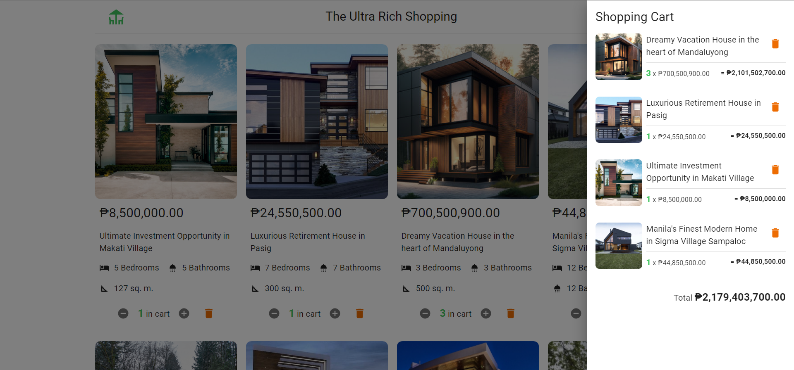

# The Ultra Rich Shopping App

This app showcase shopping cart for buying houses and real properties.

## Technologies

- React
- TypeScript
- Material UI (components)
- Context API (state manage)

## Running locally

```bash
# clone the repository
$ git clone git@github.com:MarJaysonSanAgustin/react-ts-shopping-cart-mui.git

# go inside the project
$ cd react-ts-shopping-cart-mui

# install dependencies
$ npm install

# run locally
$ npm run dev
```

## Live Demo

[Click this demo link](https://bejewelled-yeot-d5a9cc.netlify.app/)

# State Management

## Usage

To use the Shopping Cart Context, follow these steps:

1. Import the necessary components and the `useShoppingCart`` hook:

   ```ts
   import { useShoppingCart } from "./ShoppingCartProvider";
   ```

2. Wrap your application with the `ShoppingCartProvider` to make the shopping cart context available:

   ```ts
   function App() {
     return (
       <ShoppingCartProvider>{/* Your app content */}</ShoppingCartProvider>
     );
   }
   ```

3. Use the `useShoppingCart` hook to access the shopping cart context functions and state within your components.
   ```ts
   const {
     openCart,
     closeCart,
     getItemQuantity,
     increaseCartQuantity,
     decreaseCartQuantity,
     removeFromCart,
     cartQuantity,
     isOpen,
     cartItems,
   } = useShoppingCart();
   ```

## Shopping Cart Provider

The `ShoppingCartProvider` component is used to provide the shopping cart context to your application. It manages the cart state and provides the necessary functions to manipulate it.

### Props

`children` (required): ReactNode - The child components that should have access to the shopping cart context.

### useShoppingCart

The `useShoppingCart` hook is used to access the shopping cart context within your components.

```ts
const {
  openCart,
  closeCart,
  getItemQuantity,
  increaseCartQuantity,
  decreaseCartQuantity,
  removeFromCart,
  cartQuantity,
  isOpen,
  cartItems,
} = useShoppingCart();
```

### Shopping Cart Context

The Shopping Cart Context provides the following state and functions:

- `openCart`: Function to open the shopping cart.

- `closeCart`: Function to close the shopping cart.

- `getItemQuantity`: Function that takes an id as a parameter and returns the quantity of that item in the cart.

- `increaseCartQuantity`: Function to increment the quantity of an item in the cart. It takes the id of the item as a parameter.

- `decreaseCartQuantity`: Function to decrement the quantity of an item in the cart. It takes the id of the item as a parameter.

- `removeFromCart`: Function to remove an item from the cart. It takes the id of the item as a parameter.

## Screenshots




## I still think I can buy a house...


